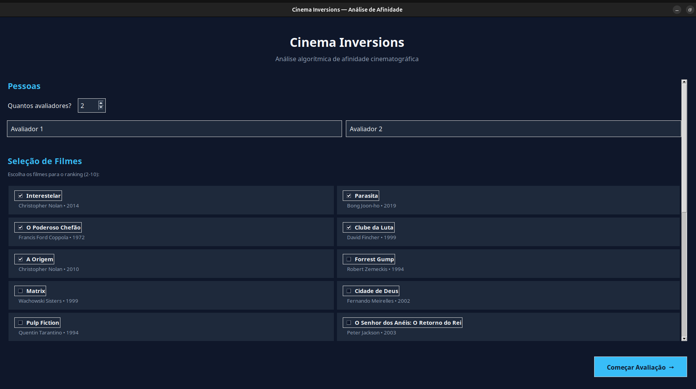
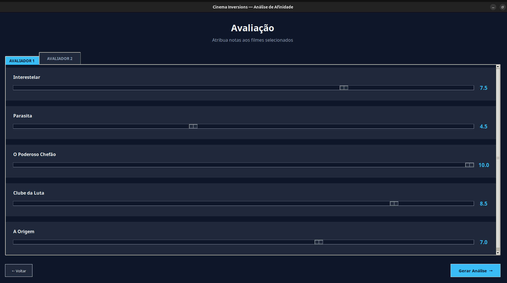
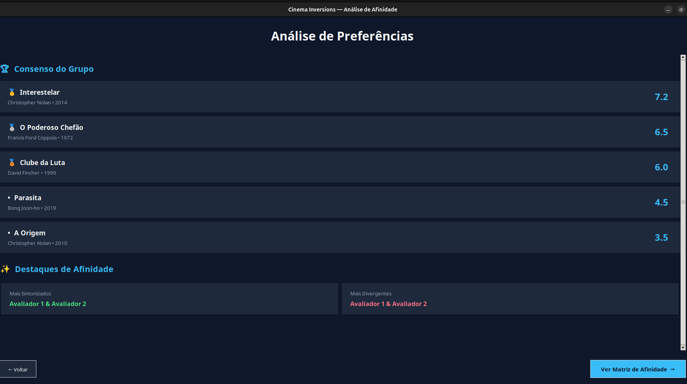
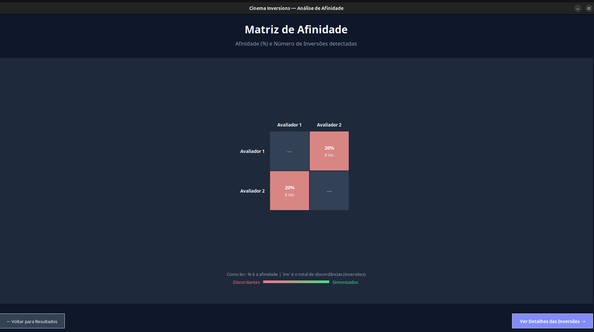
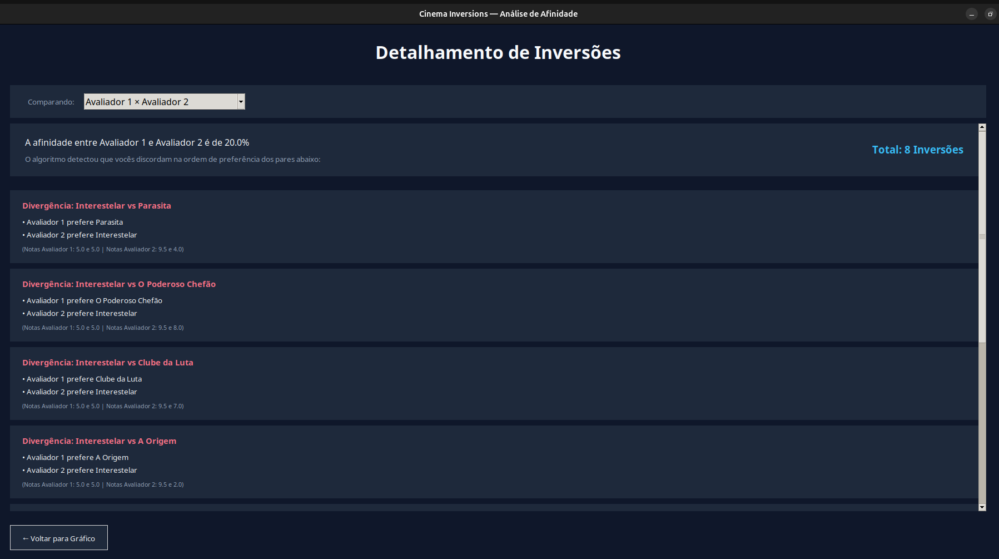

# G30_DivideConquer_PA-26.1

# Movie Inversion Counter

Número da Lista: 30 <br>
Conteúdo da Disciplina: Dividir e Conquistar

## Alunos

| Matrícula  | Aluno                        |
| ---------- | ---------------------------- |
| 20/0032364 | Vitor Gabriel Gonçalves Dias |
| 22/1008632 | Eduardo de Almeida Ferreira  |

## Sobre

O **Movie Inversion Counter** é uma aplicação desenvolvida para analisar o grau de concordância entre diferentes pessoas na avaliação de filmes.

O projeto utiliza o conceito de **contagem de inversões**, resolvido através da técnica de **Divide e Conquista** com **Merge Sort**, permitindo identificar quantas discordâncias existem entre os rankings de preferência de duas ou mais pessoas.

A ideia central é comparar as avaliações atribuídas aos filmes e medir o quanto as preferências divergem entre os participantes.

### Funcionalidades

* Seleção de filmes a partir de uma base de dados.
* Avaliação individual dos filmes por múltiplos participantes.
* Cálculo eficiente do número de inversões entre rankings.
* Identificação dos pares de filmes que geram discordâncias.
* Ranking agregado do grupo baseado na média das avaliações.
* Matriz de afinidade entre participantes.
* Heatmap visual de similaridade.
* Destaque para os participantes mais alinhados e mais divergentes.

## Fundamentação Teórica

Uma inversão entre dois rankings ocorre quando dois itens aparecem em ordens diferentes para dois avaliadores.

Exemplo:

Pessoa A:

1. Filme X
2. Filme Y

Pessoa B:

1. Filme Y
2. Filme X

Nesse caso existe uma inversão, pois a ordem relativa dos filmes foi invertida.

Para contar inversões de forma eficiente, o projeto utiliza o algoritmo de **Merge Sort com contagem de inversões**, cuja complexidade é **O(n log n)**, enquanto uma abordagem ingênua exigiria **O(n²)**. Dessa forma, é possível comparar rankings de filmes de maneira muito mais eficiente, mesmo quando a quantidade de avaliações aumenta significativamente.

## Screenshots







## Instalação

**Linguagem:** Python 3.10+
**Framework:** Tkinter

### 1. Clone o repositório

```bash
git clone https://github.com/projeto-de-algoritmos-2026/G30_Dividir-e-Conquistar_PA-26.1.git
```

### 3. Execute a aplicação

```bash
python app.py
```

## Dependências

O projeto utiliza apenas bibliotecas nativas do Python:

* tkinter
* json
* math

Caso o Tkinter não esteja instalado:

### Linux (Ubuntu/Debian)

```bash
sudo apt update
sudo apt install python3-tk
```

### Windows

O Tkinter normalmente acompanha a instalação padrão do Python.

## Uso

### 1. Seleção de Filmes

* Escolha os filmes que serão avaliados.
* Os dados são carregados do arquivo `movies.json`.

### 2. Avaliação

* Cada participante atribui notas aos filmes selecionados.
* As notas variam de 1 a 10.

### 3. Geração da Análise

Após concluir as avaliações, o sistema:

* Calcula o ranking médio dos filmes.
* Conta inversões entre todos os pares de participantes.
* Calcula índices de similaridade.
* Identifica afinidades e divergências.

### 4. Visualização dos Resultados

A aplicação apresenta:

* Ranking consolidado do grupo.
* Participantes mais alinhados.
* Participantes mais divergentes.
* Heatmap de afinidade.
* Lista detalhada de inversões entre pares de usuários.

## Estrutura do Projeto

```text
movie_inversions_completo/
│
├── app.py
├── inversions.py
├── movies.json
│
├── tela_config.py
├── tela_avaliacao.py
├── tela_resultados.py
├── tela_grafico.py
├── tela_inversoes.py
│
└── README.md
```

### Principais Arquivos

| Arquivo            | Responsabilidade                       |
| ------------------ | -------------------------------------- |
| app.py             | Inicialização e navegação da aplicação |
| inversions.py      | Algoritmo de contagem de inversões     |
| tela_config.py     | Configuração inicial                   |
| tela_avaliacao.py  | Avaliação dos filmes                   |
| tela_resultados.py | Ranking agregado e estatísticas        |
| tela_grafico.py    | Heatmap de afinidade                   |
| tela_inversoes.py  | Detalhamento das inversões             |

## Vídeo - Apresentação
[](https://www.youtube.com/watch?v=f52sgjzDYxE)

## Resultados Esperados

O sistema permite responder perguntas como:

* Quais participantes possuem gostos mais parecidos?
* Quais participantes discordam mais sobre os filmes?
* Qual é o ranking coletivo dos filmes?
* Quantas inversões existem entre dois rankings?

Tudo isso utilizando uma solução eficiente baseada em **Divide e Conquista**, demonstrando uma aplicação prática da contagem de inversões com Merge Sort.
